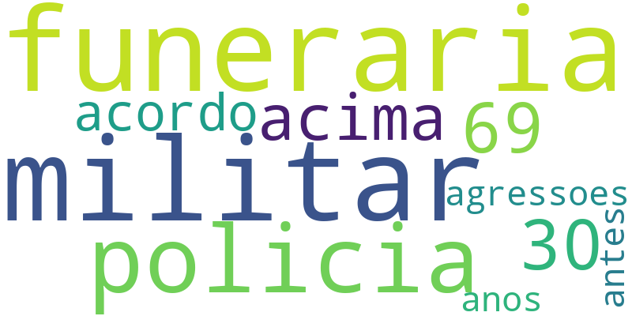

# Análise de Palavras com Python

Projeto simples de Processamento de Linguagem Natural (NLP) usando Python.

## Tecnologias utilizadas

* Python
* NLTK
* Scikit-learn
* WordCloud
* Matplotlib

## Funcionalidades

* limpeza e normalização de texto
* remoção de stopwords
* cálculo TF-IDF
* geração de nuvem de palavras

## Como executar

```bash id="j6v2pr"
python main.py
```
Projeto em Python para análise de texto com TF-IDF e WordCloud.
## Exemplo da nuvem de palavras


